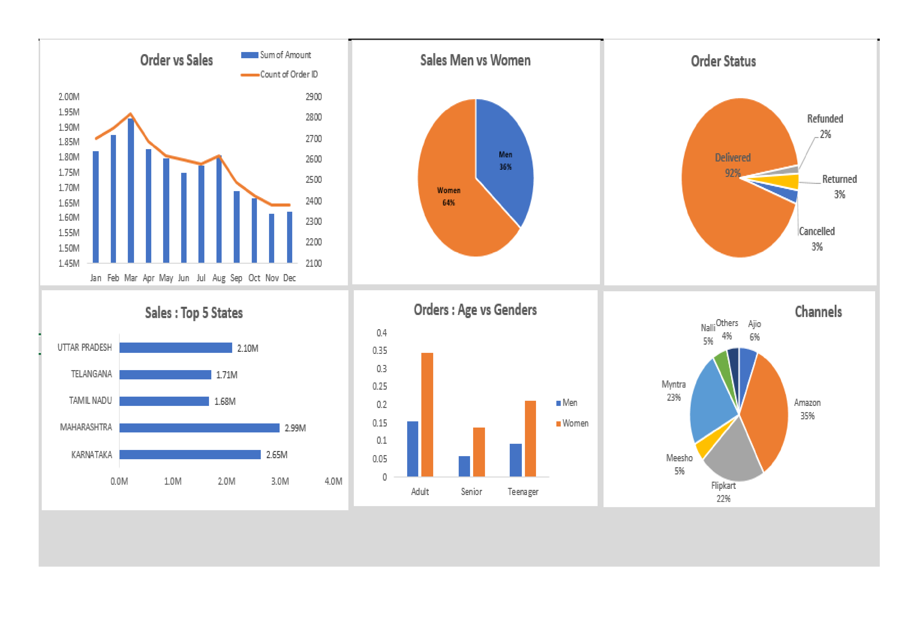

# Store Insights: Excel-driven Analysis of Sales, Inventory & Customer Data

## Project Overview:

In November 2023, I spearheaded a comprehensive data analysis project aimed at providing insights into sales, inventory management, and customer behavior for the Vrinda store. Leveraging advanced Excel functionalities and data visualization techniques, the project aimed to optimize decision-making processes and drive strategic initiatives for the store.

## Project Objectives:

1. Analyze Sales Performance: The primary objective was to evaluate the store's sales performance over a specified period. This involved identifying trends, patterns, and anomalies in sales data to uncover potential opportunities for revenue growth and optimization.

2. Assess Inventory Management: Another key focus area was to assess the effectiveness of inventory management practices. By analyzing inventory data, the project aimed to identify inventory turnover rates, stockout incidents, and inventory holding costs to optimize inventory levels and improve operational efficiency.

3. Understand Customer Behavior: Additionally, the project sought to gain insights into customer behavior and preferences. By analyzing customer data such as purchase history, demographics, and buying patterns, the project aimed to identify customer segments, preferences, and trends to tailor marketing strategies and enhance customer satisfaction.

## Development Process:

### Data Collection and Preparation:
The first step involved gathering raw data from multiple sources, including sales databases, inventory records, and customer databases. This data encompassed a wide range of metrics, including sales transactions, product information, inventory levels, customer demographics, and purchase history.

Once collected, the raw data underwent thorough cleaning and transformation to remove inconsistencies, errors, and duplicates. Data cleansing techniques such as outlier detection, missing value imputation, and standardization were applied to ensure the integrity and accuracy of the dataset.

### Excel Dashboard Creation:
Central to the project was the creation of a comprehensive Excel dashboard that consolidated and visualized key insights from the data analysis. The dashboard featured interactive elements such as slicers, dropdown menus, and filters, allowing users to dynamically explore and refine the data based on their specific requirements.

Dynamic charts and graphs were incorporated into the dashboard to visually represent sales trends, inventory levels, and customer behavior. These visualizations provided stakeholders with a clear and intuitive understanding of the data, enabling informed decision-making and strategic planning.

### Data Analysis and Insights:
Using advanced Excel functionalities such as pivot tables, formulas, and conditional formatting, in-depth analysis was conducted to derive actionable insights from the data. Key performance indicators (KPIs) such as sales growth rates, inventory turnover ratios, and customer retention rates were calculated to measure the effectiveness of business operations and identify areas for improvement.

Insights gained from the analysis were documented and communicated to stakeholders through detailed reports and presentations. Recommendations for strategic initiatives and actionable steps to optimize sales, inventory management, and customer engagement were provided based on the findings.

## Key Features:

### Interactive Dashboard:
The Excel dashboard offered an interactive and user-friendly interface for exploring and analyzing the data. Users could dynamically filter and drill down into the data using slicers and filters, enabling them to focus on specific aspects of sales, inventory, and customer behavior.

### Dynamic Visualizations:
Dynamic charts, graphs, and tables were used to visually represent key insights and trends. These visualizations updated in real-time based on user input, providing stakeholders with a dynamic and up-to-date view of the data.

### Data-driven Decision Making:
By leveraging the power of data analysis, stakeholders were empowered to make informed decisions and strategic recommendations. The insights derived from the analysis served as a foundation for driving business growth, optimizing operations, and enhancing customer satisfaction.

## Conclusion:

The "Store Insights" project represented a significant milestone in leveraging data analytics to drive business value and competitive advantage for the Vrinda store. By harnessing the combined power of Excel, Power BI, data cleaning, and data visualization techniques, the project delivered actionable insights and recommendations for optimizing sales, inventory management, and customer engagement.

Moving forward, continued investment in data analytics capabilities and a data-driven mindset will be crucial for staying competitive in the ever-evolving retail landscape.

